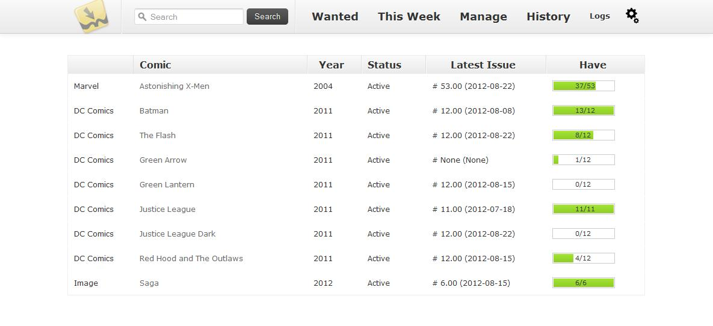

!!! warning
    This is not a complete recipe - it's a component of the [autopirate](/recipies/autopirate/start/) "_uber-recipe_", but has been split into its own page to reduce complexity.

# NAME

Intro



Details

## Inclusion into AutoPirate

To include NZBGet in your [AutoPirate](/recipies/autopirate/start/) stack, include the following in your autopirate.yml stack definition file:

!!! tip
        I share (_with my [patreon patrons](https://www.patreon.com/funkypenguin)_) a private "_premix_" git repository, which includes necessary docker-compose and env files for all published recipes. This means that patrons can launch any recipe with just a ```git pull``` and a ```docker stack deploy``` 👍

````
mylar:
  image: linuxserver/mylar:latest
  env_file : /var/data/config/autopirate/mylar.env
  volumes:
   - /var/data/autopirate/mylar:/config
   - /var/data/media:/media
  networks:
  - traefik_public
  -
mylar_proxy:
  image: zappi/oauth2_proxy
  env_file : /var/data/config/autopirate/mylar.env
  dns_search: myswarm.example.com  
  networks:
    - internal
    - traefik_public
  deploy:
    labels:
      - traefik.frontend.rule=Host:mylar.example.com
      - traefik.docker.network=traefik_public
      - traefik.port=4180
  volumes:
    - /var/data/config/autopirate/authenticated-emails.txt:/authenticated-emails.txt
  command: |
    -cookie-secure=false
    -upstream=http://mylar:8090
    -redirect-url=https://mylar.example.com
    -http-address=http://0.0.0.0:4180
    -email-domain=example.com
    -provider=github
    -authenticated-emails-file=/authenticated-emails.txt
````

!!! tip
        I share (_with my [patreon patrons](https://www.patreon.com/funkypenguin)_) a private "_premix_" git repository, which includes necessary docker-compose and env files for all published recipes. This means that patrons can launch any recipe with just a ```git pull``` and a ```docker stack deploy``` 👍

## Chef's Notes

1. In many cases, tools will integrate with each other. I.e., Radarr needs to talk to SABnzbd and NZBHydra, Ombi needs to talk to Radarr, etc. Since each tool runs within the stack under its own name, just refer to each tool by name (i.e. "radarr"), and docker swarm will resolve the name to the appropriate container. You can identify the tool-specific port by looking at the docker-compose service definition.

## Your comments?
