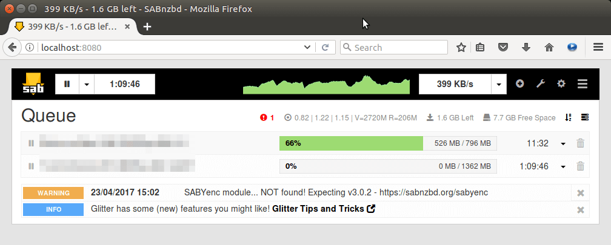

!!! warning
    This is not a complete recipe - it's a component of the [AutoPirate](/recipies/autopirate/) "_uber-recipe_", but has been split into its own page to reduce complexity.

# SABnzbd

## Introduction

SABnzbd is the workhorse of the stack. It takes .nzb files as input (_manually or from other [autopirate](/recipies/autopirate/) stack tools_), then connects to your chosen Usenet provider, downloads all the individual binaries referenced by the .nzb, and then tests/repairs/combines/uncompresses them all into the final result - media files.



!!! tip "Sponsored Project"
    SABnzbd is one of my [sponsored projects](/sponsored-projects/) - a project I financially support on a regular basis because of its utility to me. It's not sexy, but it's consistent and reliable, and I enjoy the fruits of its labor near-daily.

## Inclusion into AutoPirate

To include SABnzbd in your [AutoPirate](/recipies/autopirate/) stack
(_The only reason you **wouldn't** use SABnzbd, would be if you were using [NZBGet](/recipies/autopirate/nzbget.md) instead_), include the following in your autopirate.yml stack definition file:

!!! tip
        I share (_with my [patreon patrons](https://www.patreon.com/funkypenguin)_) a private "_premix_" git repository, which includes necessary docker-compose and env files for all published recipes. This means that patrons can launch any recipe with just a ```git pull``` and a ```docker stack deploy``` 👍

````
sabnzbd:
  image: linuxserver/sabnzbd:latest
  env_file : /var/data/config/autopirate/sabnzbd.env  
  volumes:
   - /var/data/autopirate/sabnzbd:/config
   - /var/data/media:/media
  networks:
  - internal

sabnzbd_proxy:
  image: a5huynh/oauth2_proxy
  env_file : /var/data/config/autopirate/sabnzbd.env
  networks:
    - internal
    - traefik_public
  deploy:
    labels:
      - traefik.frontend.rule=Host:sabnzbd.example.com
      - traefik.docker.network=traefik_public
      - traefik.port=4180
  volumes:
    - /var/data/config/autopirate/authenticated-emails.txt:/authenticated-emails.txt
  command: |
    -cookie-secure=false
    -upstream=http://sabnzbd:8080
    -redirect-url=https://sabnzbd.example.com
    -http-address=http://0.0.0.0:4180
    -email-domain=example.com
    -provider=github
    -authenticated-emails-file=/authenticated-emails.txt
````

!!! warning "Important Note re hostname validation"

    (**Updated 10 June 2018**) : In SABnzbd [2.3.3](https://sabnzbd.org/wiki/extra/hostname-check.html), hostname verification was added as a mandatory check. SABnzbd will refuse inbound connections which weren't addressed to its own (_initially, autodetected_) hostname. This presents a problem within Docker Swarm, where container hostnames are random and disposable.

    You'll need to edit sabnzbd.ini (_only created after your first launch_), and **replace** the value in ```host_whitelist``` configuration (_it's comma-separated_) with the name of your service within the swarm definition, as well as your FQDN as accessed via traefik.

    For example, mine simply reads ```host_whitelist = sabnzbd.funkypenguin.co.nz, sabnzbd```

## Assemble more tools..

Continue through the list of tools below, adding whichever tools your want to use, and finishing with the **[end](/recipies/autopirate/end/)** section:

* SABnzbd (this page)
* [NZBGet](/recipies/autopirate/nzbget.md)
* [RTorrent](/recipies/autopirate/rtorrent/)
* [Sonarr](/recipies/autopirate/sonarr/)
* [Radarr](/recipies/autopirate/radarr/)
* [Mylar](/recipies/autopirate/mylar/)
* [Lazy Librarian](/recipies/autopirate/lazylibrarian/)
* [Headphones](/recipies/autopirate/headphones/)
* [Lidarr](/recipies/autopirate/lidarr/)
* [NZBHydra](/recipies/autopirate/nzbhydra/)
* [NZBHydra2](/recipies/autopirate/nzbhydra2/)
* [Ombi](/recipies/autopirate/ombi/)
* [Jackett](/recipies/autopirate/jackett/)
* [Heimdall](/recipies/autopirate/heimdall/)
* [End](/recipies/autopirate/end/) (launch the stack)


## Chef's Notes 📓

1. In many cases, tools will integrate with each other. I.e., Radarr needs to talk to SABnzbd and NZBHydra, Ombi needs to talk to Radarr, etc. Since each tool runs within the stack under its own name, just refer to each tool by name (i.e. "radarr"), and docker swarm will resolve the name to the appropriate container. You can identify the tool-specific port by looking at the docker-compose service definition.

### Tip your waiter (donate) 👏

Did you receive excellent service? Want to make your waiter happy? (_..and support development of current and future recipes!_) See the [support](/support/) page for (_free or paid)_ ways to say thank you! 👏

### Your comments? 💬
