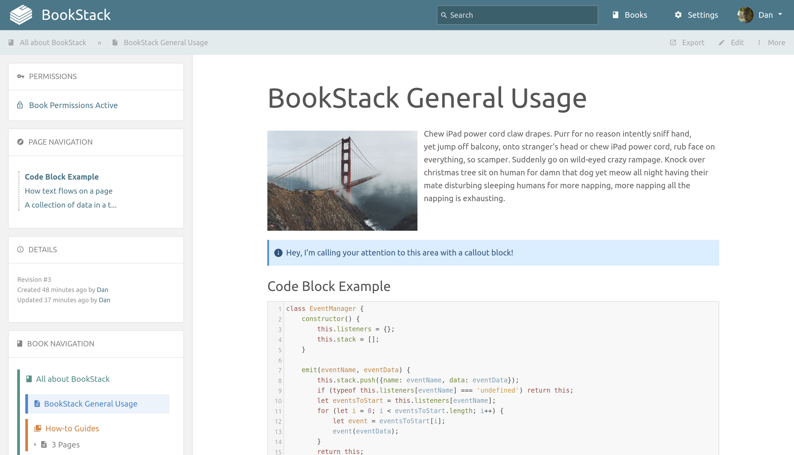

hero: Heroic Hero

# BookStack

BookStack is a simple, self-hosted, easy-to-use platform for organising and storing information.

A friendly middle ground between heavyweights like MediaWiki or Confluence and [Gollum](/recipies/gollum/), BookStack relies on a database backend (so searching and versioning is easy), but limits itself to a pre-defined, 3-tier structure (book, chapter, page). The result is a lightweight, approachable personal documentation stack, which includes search and Markdown editing.



I like to protect my public-facing web UIs with an [oauth_proxy](/reference/oauth_proxy), ensuring that if an application bug (or a user misconfiguration) exposes the app to unplanned public scrutiny, I have a second layer of defense.

## Ingredients

1. [Docker swarm cluster](/ha-docker-swarm/design/) with [persistent shared storage](/ha-docker-swarm/shared-storage-ceph.md)
2. [Traefik](/ha-docker-swarm/traefik_public) configured per design
3. DNS entry for the hostname you intend to use, pointed to your [keepalived](ha-docker-swarm/keepalived/) IP

## Preparation

### Setup data locations

We'll need several directories to bind-mount into our container, so create them in /var/data/bookstack:

```
mkdir -p /var/data/bookstack/database-dump
mkdir -p /var/data/runtime/bookstack/db
```

### Prepare environment

Create bookstack.env, and populate with the following variables. Set the [oauth_proxy](/reference/oauth_proxy) variables provided by your OAuth provider (if applicable.)

```
# For oauth-proxy (optional)
OAUTH2_PROXY_CLIENT_ID=
OAUTH2_PROXY_CLIENT_SECRET=
OAUTH2_PROXY_COOKIE_SECRET=

# For MariaDB/MySQL database
MYSQL_RANDOM_ROOT_PASSWORD=true
MYSQL_DATABASE=bookstack
MYSQL_USER=bookstack
MYSQL_PASSWORD=secret

# Bookstack-specific variables
DB_HOST=bookstack_db:3306
DB_DATABASE=bookstack
DB_USERNAME=bookstack
DB_PASSWORD=secret
```

### Setup Docker Swarm

Create a docker swarm config file in docker-compose syntax (v3), something like this:

!!! tip
        I share (_with my [patreon patrons](https://www.patreon.com/funkypenguin)_) a private "_premix_" git repository, which includes necessary docker-compose and env files for all published recipes. This means that patrons can launch any recipe with just a ```git pull``` and a ```docker stack deploy``` 👍


```
version: '3'

services:

  db:
    image: mariadb:10
    env_file: /var/data/config/bookstack/bookstack.env
    networks:
      - internal
    volumes:
      - /var/data/runtime/bookstack/db:/var/lib/mysql

  proxy:
    image: a5huynh/oauth2_proxy
    env_file : /var/data/config/bookstack/bookstack.env
    networks:
      - internal
      - traefik_public
    deploy:
      labels:
        - traefik.frontend.rule=Host:bookstack.example.com
        - traefik.docker.network=traefik_public
        - traefik.port=4180
    volumes:
      - /var/data/config/bookstack/authenticated-emails.txt:/authenticated-emails.txt
    command: |
      -cookie-secure=false
      -upstream=http://app
      -redirect-url=https://bookstack.example.com
      -http-address=http://0.0.0.0:4180
      -email-domain=example.com
      -provider=github
      -authenticated-emails-file=/authenticated-emails.txt

  app:
    image: solidnerd/bookstack
    env_file: /var/data/config/bookstack/bookstack.env
    networks:
      - internal

  db-backup:
    image: mariadb:10
    env_file: /var/data/config/bookstack/bookstack.env
    volumes:
      - /var/data/bookstack/database-dump:/dump
      - /etc/localtime:/etc/localtime:ro
    entrypoint: |
      bash -c 'bash -s <<EOF
      trap "break;exit" SIGHUP SIGINT SIGTERM
      sleep 2m
      while /bin/true; do
        mysqldump -h db --all-databases | gzip -c > /dump/dump_\`date +%d-%m-%Y"_"%H_%M_%S\`.sql.gz
        (ls -t /dump/dump*.sql.gz|head -n $$BACKUP_NUM_KEEP;ls /dump/dump*.sql.gz)|sort|uniq -u|xargs rm -- {}
        sleep $$BACKUP_FREQUENCY
      done
      EOF'
    networks:
    - internal

networks:
  traefik_public:
    external: true
  internal:
    driver: overlay
    ipam:
      config:
        - subnet: 172.16.33.0/24
```

!!! note
    Setup unique static subnets for every stack you deploy. This avoids IP/gateway conflicts which can otherwise occur when you're creating/removing stacks a lot. See [my list](/reference/networks/) here.


## Serving

### Launch Bookstack stack

Launch the BookStack stack by running ```docker stack deploy bookstack -c <path -to-docker-compose.yml>```

Log into your new instance at https://**YOUR-FQDN**, authenticate with oauth_proxy, and then login with username 'admin@admin.com' and password 'password'.

## Chef's Notes

1. If you wanted to expose the BookStack UI directly, you could remove the oauth2_proxy from the design, and move the traefik_public-related labels directly to the bookstack container. You'd also need to add the traefik_public network to the bookstack container.

### Tip your waiter (donate) 👏

Did you receive excellent service? Want to make your waiter happy? (_..and support development of current and future recipes!_) See the [support](/support/) page for (_free or paid)_ ways to say thank you! 👏

### Your comments? 💬
