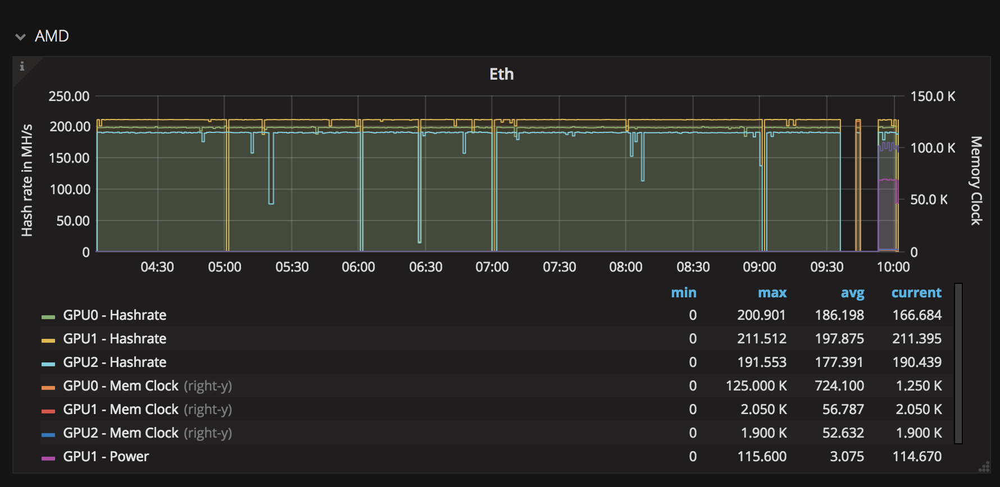

# Monitor

!!! warning
    This is not a complete recipe - it's a component of the [cryptominer](/recipies/cryptominer/) "_uber-recipe_", but has been split into its own page to reduce complexity.

So, you're a miner! But if you're not **actively** mining, are you still a miner? This page details how to **measure** your mining activity, and how to raise an alert when a profit-affecting issue affects your miners.

## Ingredients

1. [InfluxDB+Grafana](https://www.funkypenguin.co.nz/note/adding-custom-data-to-influxdb-and-grafana/) instance, for visualising data
2. [Icinga](https://www.icinga.com/), [Nagios](https://www.nagios.org/) etc for alarming on GPU/miner status
3. [Asi MPM](https://www.asimpm.com/) (iOS) for monitoring your miner/pool status
4. [Altpocket](https://altpocket.io/?ref=ilVqdeWbAv), [CoinTracking](https://cointracking.info?ref=F560640), etc for managing your crypto-asset portfolio (_referral links_)

## Preparation

### Visualising performance

Since [Minerhotel](/recipies/crytominer/minerhotel/) switches currency based on what's most profitable in the moment, it's hard to gauge the impact of changes (overclocking, tweaking, mining pools) over time.

I hacked up a bash script which grabs performance data from the output of the miners, and throws it into an InfluxDB database, which can then be visualized using Grafana.

Here's an early version of the script (_it's since been updated for clockspeed and power usage too_):

!!! tip
        I share (_with my [patreon patrons](https://www.patreon.com/funkypenguin)_) a private "_premix_" git repository, which includes up-to-date versions of the InfluxDB /Grafana script mentioned above, as well as pre-setup Grafana graphs, so that patrons can simply "_git pull_" and start monitoring 

### Alarming on failure

GPU mining can fail in subtle ways. On occasion, I've tweaked my GPUs to the point that the miner will start, but one or all GPUs will report a zero hash rate. I wanted to be alerted to such profit-affecting issues, so I wrote a bash script (_intended to be executed by NRPE from Icinga, Nagios, etc_).

The script tests the output of the currently active miner, and ensures the GPUs have a valid hashrate.

!!! tip
        I share (_with my [patreon patrons](https://www.patreon.com/funkypenguin)_) a private "_premix_" git repository, which includes up-to-date versions of the Icinga scripts mentioned above, so that patrons can simply "_git pull_" and start monitoring 

### Monitoring pool/miner status

I've tried several iOS apps for monitoring my performance across various. The most useful app I've found thus far is [Asi MPM](https://www.asimpm.com/). It requires a little upfront effort to configure for all your coins/pools, but thereafter it's a handy way to keep tabs on your new obsession!

### Track your portfolio

Now that you've got your coins happily cha-chinging into you [wallets](/recipies/cryptominer/wallet/) (_and potentially various [exchanges](/recipies/cryptominer/exchange/)_), you'll want to monitor the performance of your portfolio over time.

#### Web Apps

There's a detailed breakdown of porfolio-management apps [here](https://www.cryptostache.com/2017/11/10/keeping-track-cryptocurrency-portfolio-best-apps-2017/).

Personally, I use:

* [Altpocket](https://altpocket.io/?ref=ilVqdeWbAv) (A free web app which can auto-sync with certain exchanges and wallets)
* [CoinTracking](https://cointracking.info?ref=F560640) - The top crypto-portfolio manager, by far. But it's expensive when you get to > 200 trades. You get what you pay for ;)

#### Mobile Apps

I've found the following iOS apps to be useful in tracking my portfolio (_really more for investing than mining though, since portfolio tracking requires a manual entry for each trade_)

* [Delta](https://itunes.apple.com/us/app/delta-crypto-ico-portfolio/id1288676542?mt=8) (iOS) - Track your portfolio (losses/gains) and alert you to changes in the coins you watch
* [Bitscreener](https://itunes.apple.com/app/apple-store/id1240849311?mt=8) )(iOS) - Track multiple currencies on a watchlist, and quickly view news/discussion per coin

!!! note
    Some of the links above are referral links. I get some goodies when you use them.

## Continue your adventure

Now, continue to the next stage of your grand mining adventure:

1. Build your [mining rig](/recipies/cryptominer/mining-rig/) 💻
2. Setup your [AMD](/recipies/cryptominer/amd-gpu/) or [Nvidia](/recipies/cryptominer/nvidia-gpu/) GPUs 🎨
3. Sign up for [mining pools](/recipies/cryptominer/mining-pool/) :swimmer:
4. Setup your miners with [Miner Hotel](/recipies/cryptominer/minerhotel/) 🏨
5. Send your coins to [exchanges](/recipies/cryptominer/exchange/) or [wallets](/recipies/cryptominer/wallet/) 💹
6. Monitor your empire :heartbeat: (_this page_)
7. [Profit](/recipies/cryptominer/profit/)! 

## Chef's Notes

1. Ultimately I hope to move all the configuration / mining executables into docker containers, but for now, they're running on a CentOS7 host for direct access to GPUs. (_Apparently it **may** be possible to pass-thru the GPUs to docker containers, but I wanted stability first, before abstracting my hardware away from my miners_)

### Tip your waiter (donate) 

Did you receive excellent service? Want to make your waiter happy? (_..and support development of current and future recipes!_) See the [support](/support/) page for (_free or paid)_ ways to say thank you! 

### Your comments? 
