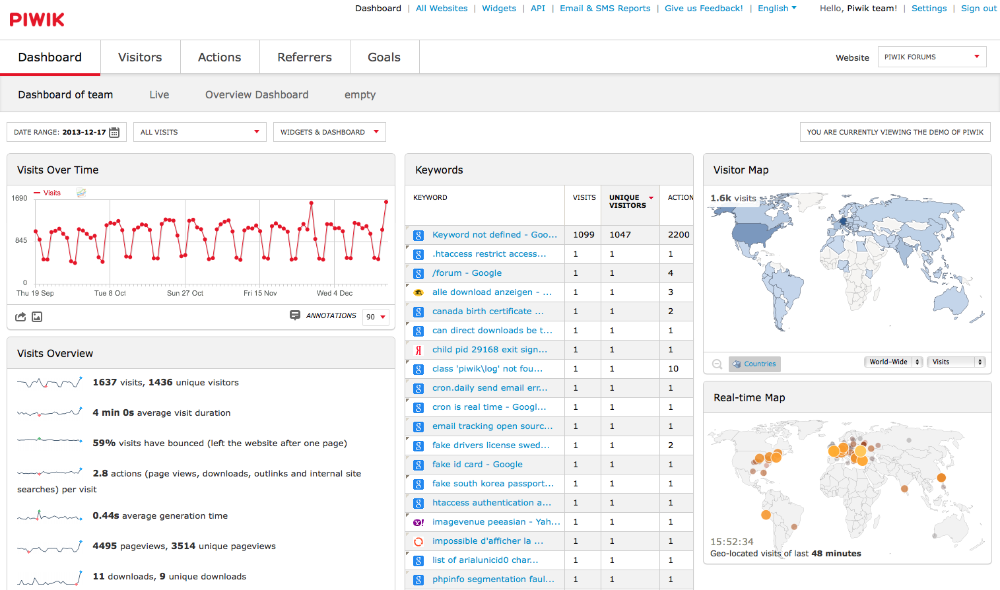

# Piwik

[Piwik](http://www.piwik.org) is a rich open-source web analytics platform, which can be coupled with commercial plugins for additional features. It's most simply described as "_self-hosted Google Analytics_".



## Ingredients

1. [Docker swarm cluster](/ha-docker-swarm/design/) with [persistent shared storage](/ha-docker-swarm/shared-storage-ceph.md)
2. [Traefik](/ha-docker-swarm/traefik) configured per design


## Preparation

### Limitation of docker-swarm

The docker-swarm load-balancer is a problem for deploying piwik, since it rewrites the source address of every incoming packet to whichever docker node received the packet into the swarm. Which is a PITA for analytics, since the original source IP of the request is obscured.

The issue is tracked at #[25526](https://github.com/moby/moby/issues/25526), and there is a workaround, but it requires running the piwik "app" container on **every** swarm node...

### Prepare environment

Create piwik.env, and populate with the following variables

```
MYSQL_ROOT_PASSWORD=set-me-and-use-me-when-setting-up-piwik
```

### Setup docker swarm

Create a docker swarm config file in docker-compose syntax (v3), something like this:

!!! tip
        I share (_with my [patreon patrons](https://www.patreon.com/funkypenguin)_) a private "_premix_" git repository, which includes necessary docker-compose and env files for all published recipes. This means that patrons can launch any recipe with just a ```git pull``` and a ```docker stack deploy``` 👍

```
version: '3'

services:
  db:
    image: mysql
    volumes:
      - /var/data/piwik/mysql/runtime:/var/lib/mysql
    env_file: /var/data/piwik/piwik.env
    networks:
    - internal
  app:
    image: piwik:apache
    volumes:
      - /var/data/piwik/config:/var/www/html/config
    networks:
    - internal
    - traefik
    deploy:
      mode: global
      labels:
        - traefik.frontend.rule=Host:piwik.example.com
        - traefik.docker.network=traefik
        - traefik.port=80
  cron:
    image: piwik:apache
    volumes:
      - /var/data/piwik/config:/var/www/html/config
    entrypoint: |
      bash -c 'bash -s <<EOF
      trap "break;exit" SIGHUP SIGINT SIGTERM
      while /bin/true; do
        su -s "/bin/bash" -c "/usr/local/bin/php /var/www/html/console core:archive" www-data
        sleep 3600
      done
      EOF'
    networks:
    - internal

networks:
  traefik:
    external: true
  internal:
    driver: overlay
    ipam:
      config:
        - subnet: 172.16.4.0/24
```

!!! note
    Setup unique static subnets for every stack you deploy. This avoids IP/gateway conflicts which can otherwise occur when you're creating/removing stacks a lot. See [my list](/reference/networks/) here.


## Serving

Launch the Piwik stack by running ```docker stack deploy piwik -c <path -to-docker-compose.yml>```

Log into your new instance at https://**YOUR-FQDN**, and follow the wizard to complete the setup.

### Tip your waiter (donate) 👏

Did you receive excellent service? Want to make your waiter happy? (_..and support development of current and future recipes!_) See the [support](/support/) page for (_free or paid)_ ways to say thank you! 👏

### Your comments? 💬
